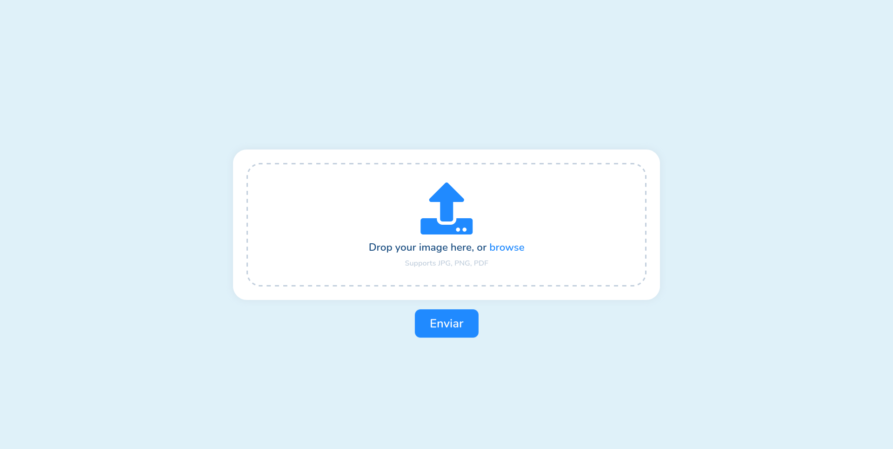

<h1 align="center">Upload de Arquivos.</h1>

Desenvolvido para fins de estudos.

Link do projeto [Upload | GithubPages](github.com/lucasarieiv/upload)

  

Baseado no Layout Desenvolvido por  🧑 by [Oğuz Yağız Kara](dribbble.com/shots/8297994-ikas-Dashboard-Image-Upload-Animation/attachments/641415?mode=media)

## Tecnologias utilizadas:
- HTML e Css
- NodeJS

